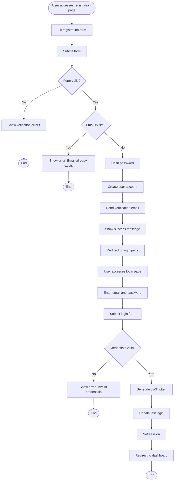
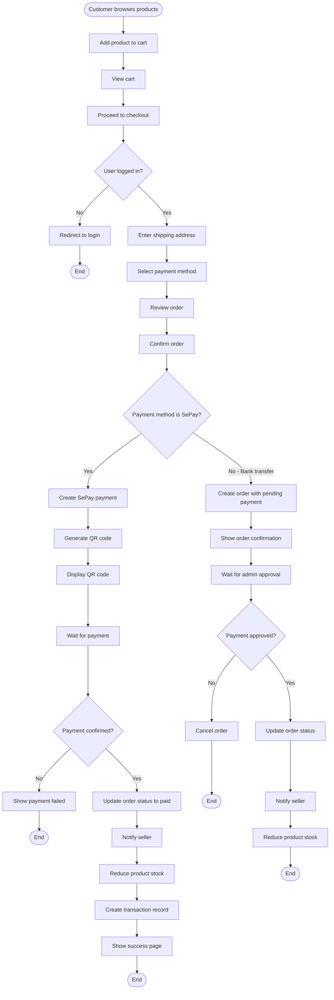
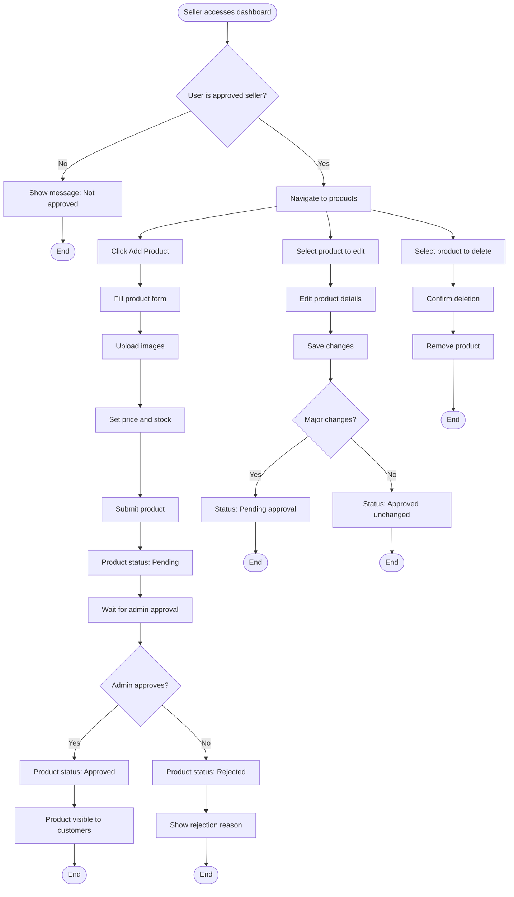
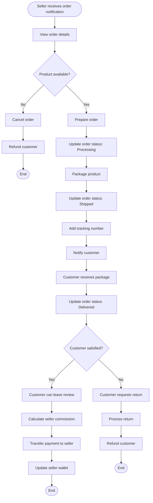
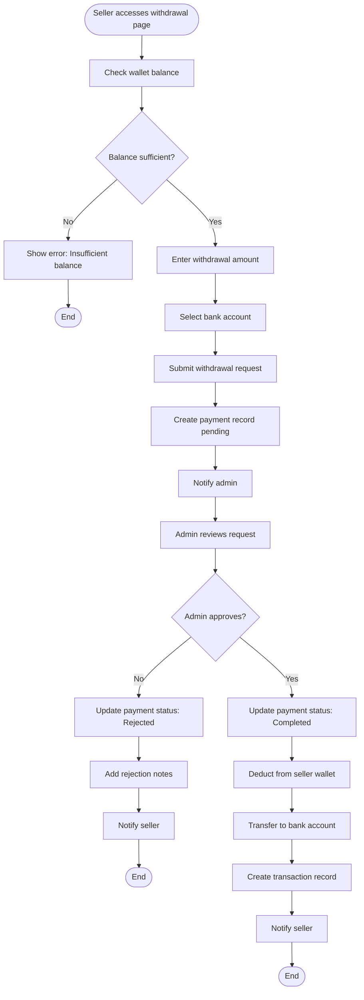

# Activity Diagrams - Bookverse Platform (Mermaid Format)

## 1. User Registration and Login Flow

## 2. Purchase Flow

## 3. Seller Product Management

## 4. Order Fulfillment

## 5. Withdrawal Process

