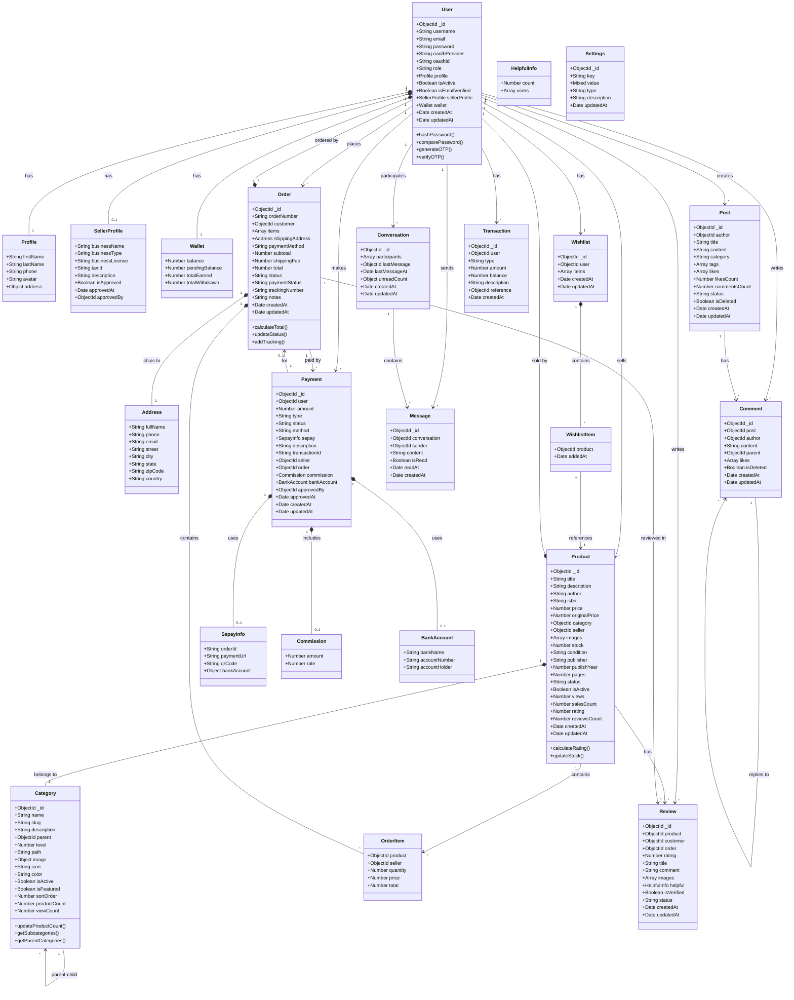
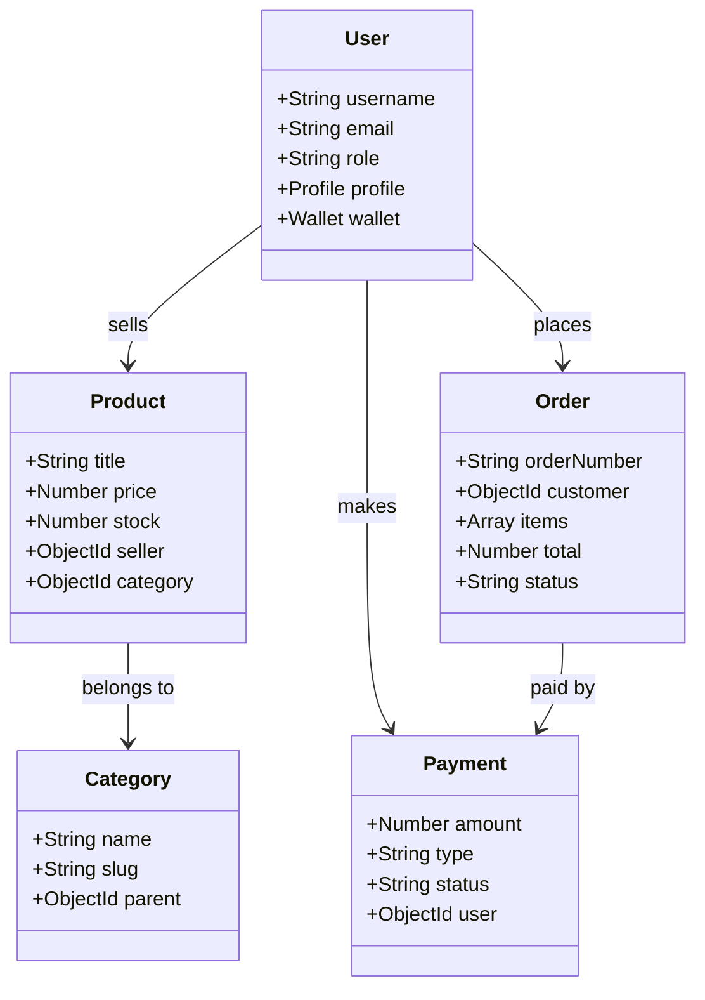

# Class Diagram - Bookverse Platform (Mermaid Format)

## Main Class Diagram

```mermaid
classDiagram
    class User {
        +ObjectId _id
        +String username
        +String email
        +String password
        +String oauthProvider
        +String oauthId
        +String role
        +Profile profile
        +Boolean isActive
        +Boolean isEmailVerified
        +SellerProfile sellerProfile
        +Wallet wallet
        +Date createdAt
        +Date updatedAt
        +hashPassword()
        +comparePassword()
        +generateOTP()
        +verifyOTP()
    }

    class Profile {
        +String firstName
        +String lastName
        +String phone
        +String avatar
        +Object address
    }

    class SellerProfile {
        +String businessName
        +String businessType
        +String businessLicense
        +String taxId
        +String description
        +Boolean isApproved
        +Date approvedAt
        +ObjectId approvedBy
    }

    class Wallet {
        +Number balance
        +Number pendingBalance
        +Number totalEarned
        +Number totalWithdrawn
    }

    class Product {
        +ObjectId _id
        +String title
        +String description
        +String author
        +String isbn
        +Number price
        +Number originalPrice
        +ObjectId category
        +ObjectId seller
        +Array images
        +Number stock
        +String condition
        +String publisher
        +Number publishYear
        +Number pages
        +String status
        +Boolean isActive
        +Number views
        +Number salesCount
        +Number rating
        +Number reviewsCount
        +Date createdAt
        +Date updatedAt
        +calculateRating()
        +updateStock()
    }

    class Category {
        +ObjectId _id
        +String name
        +String slug
        +String description
        +ObjectId parent
        +Number level
        +String path
        +Object image
        +String icon
        +String color
        +Boolean isActive
        +Boolean isFeatured
        +Number sortOrder
        +Number productCount
        +Number viewCount
        +updateProductCount()
        +getSubcategories()
        +getParentCategories()
    }

    class Order {
        +ObjectId _id
        +String orderNumber
        +ObjectId customer
        +Array items
        +Address shippingAddress
        +String paymentMethod
        +Number subtotal
        +Number shippingFee
        +Number total
        +String status
        +String paymentStatus
        +String trackingNumber
        +String notes
        +Date createdAt
        +Date updatedAt
        +calculateTotal()
        +updateStatus()
        +addTracking()
    }

    class OrderItem {
        +ObjectId product
        +ObjectId seller
        +Number quantity
        +Number price
        +Number total
    }

    class Address {
        +String fullName
        +String phone
        +String email
        +String street
        +String city
        +String state
        +String zipCode
        +String country
    }

    class Payment {
        +ObjectId _id
        +ObjectId user
        +Number amount
        +String type
        +String status
        +String method
        +SepayInfo sepay
        +String description
        +String transactionId
        +ObjectId seller
        +ObjectId order
        +Commission commission
        +BankAccount bankAccount
        +ObjectId approvedBy
        +Date approvedAt
        +Date createdAt
        +Date updatedAt
    }

    class SepayInfo {
        +String orderId
        +String paymentUrl
        +String qrCode
        +Object bankAccount
    }

    class Commission {
        +Number amount
        +Number rate
    }

    class BankAccount {
        +String bankName
        +String accountNumber
        +String accountHolder
    }

    class Review {
        +ObjectId _id
        +ObjectId product
        +ObjectId customer
        +ObjectId order
        +Number rating
        +String title
        +String comment
        +Array images
        +HelpfulInfo helpful
        +Boolean isVerified
        +String status
        +Date createdAt
        +Date updatedAt
    }

    class HelpfulInfo {
        +Number count
        +Array users
    }

    class Post {
        +ObjectId _id
        +ObjectId author
        +String title
        +String content
        +String category
        +Array tags
        +Array likes
        +Number likesCount
        +Number commentsCount
        +String status
        +Boolean isDeleted
        +Date createdAt
        +Date updatedAt
    }

    class Comment {
        +ObjectId _id
        +ObjectId post
        +ObjectId author
        +String content
        +ObjectId parent
        +Array likes
        +Boolean isDeleted
        +Date createdAt
        +Date updatedAt
    }

    class Message {
        +ObjectId _id
        +ObjectId conversation
        +ObjectId sender
        +String content
        +Boolean isRead
        +Date readAt
        +Date createdAt
    }

    class Conversation {
        +ObjectId _id
        +Array participants
        +ObjectId lastMessage
        +Date lastMessageAt
        +Object unreadCount
        +Date createdAt
        +Date updatedAt
    }

    class Wishlist {
        +ObjectId _id
        +ObjectId user
        +Array items
        +Date createdAt
        +Date updatedAt
    }

    class WishlistItem {
        +ObjectId product
        +Date addedAt
    }

    class Transaction {
        +ObjectId _id
        +ObjectId user
        +String type
        +Number amount
        +Number balance
        +String description
        +ObjectId reference
        +Date createdAt
    }

    class Settings {
        +ObjectId _id
        +String key
        +Mixed value
        +String type
        +String description
        +Date updatedAt
    }

    %% Relationships
    User "1" *-- "1" Profile : has
    User "1" *-- "0..1" SellerProfile : has
    User "1" *-- "1" Wallet : has
    User "1" --> "*" Product : sells
    User "1" --> "*" Order : places
    User "1" --> "*" Payment : makes
    User "1" --> "*" Review : writes
    User "1" --> "*" Post : creates
    User "1" --> "*" Comment : writes
    User "1" --> "*" Message : sends
    User "1" --> "*" Conversation : participates
    User "1" --> "1" Wishlist : has
    User "1" --> "*" Transaction : has

    Product "1" --> "*" OrderItem : contains
    Product "1" *-- "1" Category : belongs to
    Product "1" *-- "1" User : sold by
    Product "1" --> "*" Review : has

    Category "1" --> "*" Category : parent-child

    Order "1" *-- "*" OrderItem : contains
    Order "1" *-- "1" Address : ships to
    Order "1" *-- "1" User : ordered by
    Order "1" --> "*" Payment : paid by
    Order "1" --> "*" Review : reviewed in

    Payment "1" *-- "0..1" SepayInfo : uses
    Payment "1" *-- "0..1" Commission : includes
    Payment "1" *-- "0..1" BankAccount : uses
    Payment "1" --> "0..1" Order : for

    Post "1" --> "*" Comment : has
    Comment "1" --> "*" Comment : replies to

    Conversation "1" --> "*" Message : contains

    Wishlist "1" *-- "*" WishlistItem : contains
    WishlistItem "1" --> "1" Product : references
```

## Simplified Class Diagram (Core Entities)

```mermaid
classDiagram
    class User {
        +String username
        +String email
        +String role
        +Profile profile
        +Wallet wallet
    }

    class Product {
        +String title
        +Number price
        +Number stock
        +ObjectId seller
        +ObjectId category
    }

    class Order {
        +String orderNumber
        +ObjectId customer
        +Array items
        +Number total
        +String status
    }

    class Payment {
        +Number amount
        +String type
        +String status
        +ObjectId user
    }

    class Category {
        +String name
        +String slug
        +ObjectId parent
    }

    User --> Product : sells
    User --> Order : places
    User --> Payment : makes
    Product --> Category : belongs to
    Order --> Payment : paid by
```

