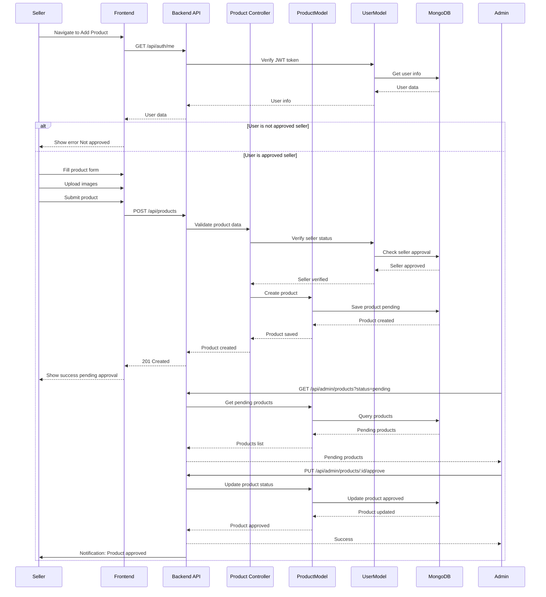

# Sequence Diagrams - Bookverse Platform (Mermaid Format)

## 1. User Registration Sequence

## 2. Product Purchase Sequence

## 3. Seller Adds Product Sequence

## 4. Order Fulfillment Sequence

## 5. Withdrawal Request Sequence

