# Use Case Diagram - Bookverse Platform

## Sơ đồ Use Case Diagram

```plantuml
@startuml Bookverse_Use_Case_Diagram

!define RECTANGLE class

left to right direction

actor Guest as "Khách vãng lai"
actor Customer as "Khách hàng"
actor Seller as "Người bán"
actor Admin as "Quản trị viên"

rectangle "Bookverse Platform" {
    
    ' Guest Use Cases
    package "Chức năng công khai" {
        usecase UC1 as "Xem danh sách sản phẩm"
        usecase UC2 as "Tìm kiếm sản phẩm"
        usecase UC3 as "Xem chi tiết sản phẩm"
        usecase UC4 as "Xem danh sách người bán"
        usecase UC5 as "Xem cửa hàng người bán"
        usecase UC6 as "Xem forum"
        usecase UC7 as "Đăng ký tài khoản"
        usecase UC8 as "Đăng nhập"
        usecase UC9 as "Quên mật khẩu"
        usecase UC10 as "Đặt lại mật khẩu"
    }
    
    ' Customer Use Cases
    package "Chức năng khách hàng" {
        usecase UC11 as "Thêm vào giỏ hàng"
        usecase UC12 as "Xem giỏ hàng"
        usecase UC13 as "Cập nhật giỏ hàng"
        usecase UC14 as "Thanh toán đơn hàng"
        usecase UC15 as "Xem lịch sử đơn hàng"
        usecase UC16 as "Theo dõi đơn hàng"
        usecase UC17 as "Quản lý tài khoản"
        usecase UC18 as "Quản lý wishlist"
        usecase UC19 as "Thêm/xóa wishlist"
        usecase UC20 as "Gửi tin nhắn"
        usecase UC21 as "Nhận tin nhắn"
        usecase UC22 as "Đánh giá sản phẩm"
        usecase UC23 as "Đăng bài forum"
        usecase UC24 as "Comment bài viết"
        usecase UC25 as "Like bài viết"
        usecase UC26 as "Nạp tiền vào ví"
        usecase UC27 as "Xem số dư ví"
        usecase UC28 as "Đăng ký làm người bán"
    }
    
    ' Seller Use Cases
    package "Chức năng người bán" {
        usecase UC29 as "Quản lý sản phẩm"
        usecase UC30 as "Thêm sản phẩm"
        usecase UC31 as "Sửa sản phẩm"
        usecase UC32 as "Xóa sản phẩm"
        usecase UC33 as "Quản lý đơn hàng cửa hàng"
        usecase UC34 as "Cập nhật trạng thái đơn hàng"
        usecase UC35 as "Thêm mã vận đơn"
        usecase UC36 as "Xem thống kê bán hàng"
        usecase UC37 as "Xem doanh thu"
        usecase UC38 as "Quản lý thông tin cửa hàng"
        usecase UC39 as "Rút tiền"
        usecase UC40 as "Quản lý tài khoản ngân hàng"
        usecase UC41 as "Xem lịch sử thanh toán"
        usecase UC42 as "Nhắn tin với khách hàng"
    }
    
    ' Admin Use Cases
    package "Chức năng quản trị" {
        usecase UC43 as "Quản lý người dùng"
        usecase UC44 as "Xem danh sách người dùng"
        usecase UC45 as "Thêm/sửa/xóa người dùng"
        usecase UC46 as "Khóa/mở khóa tài khoản"
        usecase UC47 as "Duyệt đăng ký người bán"
        usecase UC48 as "Quản lý sản phẩm hệ thống"
        usecase UC49 as "Duyệt sản phẩm"
        usecase UC50 as "Từ chối sản phẩm"
        usecase UC51 as "Quản lý đơn hàng hệ thống"
        usecase UC52 as "Quản lý danh mục"
        usecase UC53 as "Thêm/sửa/xóa danh mục"
        usecase UC54 as "Quản lý thanh toán"
        usecase UC55 as "Duyệt rút tiền"
        usecase UC56 as "Duyệt nạp tiền"
        usecase UC57 as "Xem thống kê hệ thống"
        usecase UC58 as "Xem doanh thu hệ thống"
        usecase UC59 as "Quản lý cài đặt hệ thống"
        usecase UC60 as "Xem nhật ký hoạt động"
    }
}

' Guest relationships
Guest --> UC1
Guest --> UC2
Guest --> UC3
Guest --> UC4
Guest --> UC5
Guest --> UC6
Guest --> UC7
Guest --> UC8
Guest --> UC9
Guest --> UC10

' Customer relationships (includes Guest)
Customer --> UC1
Customer --> UC2
Customer --> UC3
Customer --> UC4
Customer --> UC5
Customer --> UC6
Customer --> UC11
Customer --> UC12
Customer --> UC13
Customer --> UC14
Customer --> UC15
Customer --> UC16
Customer --> UC17
Customer --> UC18
Customer --> UC19
Customer --> UC20
Customer --> UC21
Customer --> UC22
Customer --> UC23
Customer --> UC24
Customer --> UC25
Customer --> UC26
Customer --> UC27
Customer --> UC28

' Seller relationships (includes Customer)
Seller --> UC11
Seller --> UC12
Seller --> UC13
Seller --> UC14
Seller --> UC15
Seller --> UC16
Seller --> UC17
Seller --> UC18
Seller --> UC19
Seller --> UC20
Seller --> UC21
Seller --> UC22
Seller --> UC23
Seller --> UC24
Seller --> UC25
Seller --> UC26
Seller --> UC27
Seller --> UC29
Seller --> UC30
Seller --> UC31
Seller --> UC32
Seller --> UC33
Seller --> UC34
Seller --> UC35
Seller --> UC36
Seller --> UC37
Seller --> UC38
Seller --> UC39
Seller --> UC40
Seller --> UC41
Seller --> UC42

' Admin relationships
Admin --> UC43
Admin --> UC44
Admin --> UC45
Admin --> UC46
Admin --> UC47
Admin --> UC48
Admin --> UC49
Admin --> UC50
Admin --> UC51
Admin --> UC52
Admin --> UC53
Admin --> UC54
Admin --> UC55
Admin --> UC56
Admin --> UC57
Admin --> UC58
Admin --> UC59
Admin --> UC60

' Inheritance relationships
Customer --|> Guest : extends
Seller --|> Customer : extends

@enduml
```

## Mô tả các Actor

### 1. Khách vãng lai (Guest)
- Người dùng chưa đăng nhập
- Chỉ có thể xem thông tin công khai và đăng ký/đăng nhập

### 2. Khách hàng (Customer)
- Người dùng đã đăng ký và đăng nhập
- Có thể mua sắm, quản lý đơn hàng, tương tác với hệ thống

### 3. Người bán (Seller)
- Khách hàng đã đăng ký làm người bán và được duyệt
- Có thể quản lý sản phẩm, đơn hàng, doanh thu

### 4. Quản trị viên (Admin)
- Quản lý toàn bộ hệ thống
- Duyệt sản phẩm, người bán, thanh toán

## Mô tả các Use Case chính

### Chức năng công khai
- **UC1-UC6**: Xem thông tin sản phẩm, người bán, forum
- **UC7-UC10**: Đăng ký, đăng nhập, khôi phục mật khẩu

### Chức năng khách hàng
- **UC11-UC16**: Quản lý giỏ hàng và đơn hàng
- **UC17-UC19**: Quản lý tài khoản và wishlist
- **UC20-UC22**: Tương tác (tin nhắn, đánh giá)
- **UC23-UC25**: Tham gia forum
- **UC26-UC28**: Quản lý ví và đăng ký người bán

### Chức năng người bán
- **UC29-UC32**: Quản lý sản phẩm
- **UC33-UC35**: Quản lý đơn hàng
- **UC36-UC37**: Thống kê và doanh thu
- **UC38-UC42**: Quản lý cửa hàng và thanh toán

### Chức năng quản trị
- **UC43-UC47**: Quản lý người dùng và người bán
- **UC48-UC50**: Quản lý sản phẩm hệ thống
- **UC51-UC53**: Quản lý đơn hàng và danh mục
- **UC54-UC60**: Quản lý thanh toán, thống kê, cài đặt

## Mối quan hệ kế thừa
- **Customer extends Guest**: Khách hàng có tất cả quyền của khách vãng lai
- **Seller extends Customer**: Người bán có tất cả quyền của khách hàng

